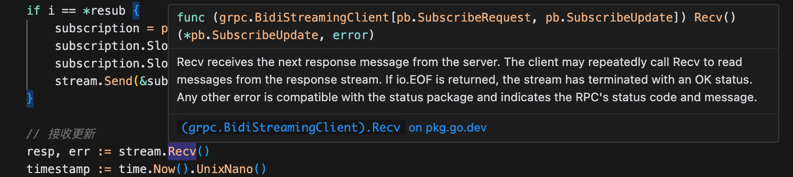
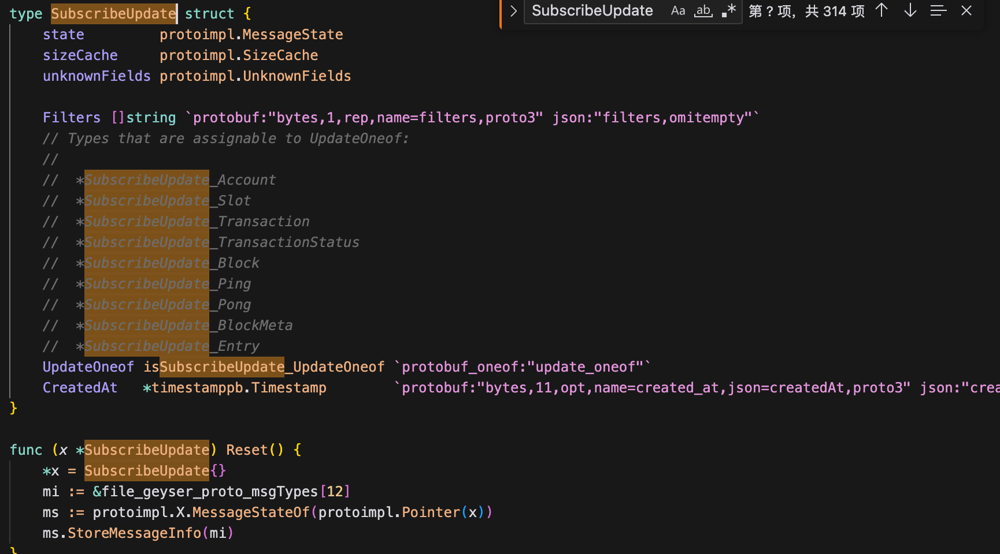
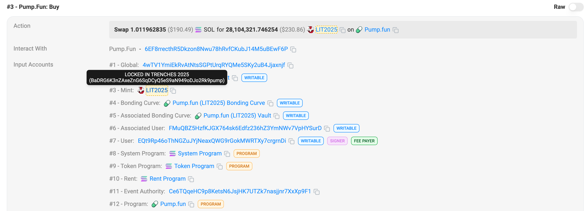
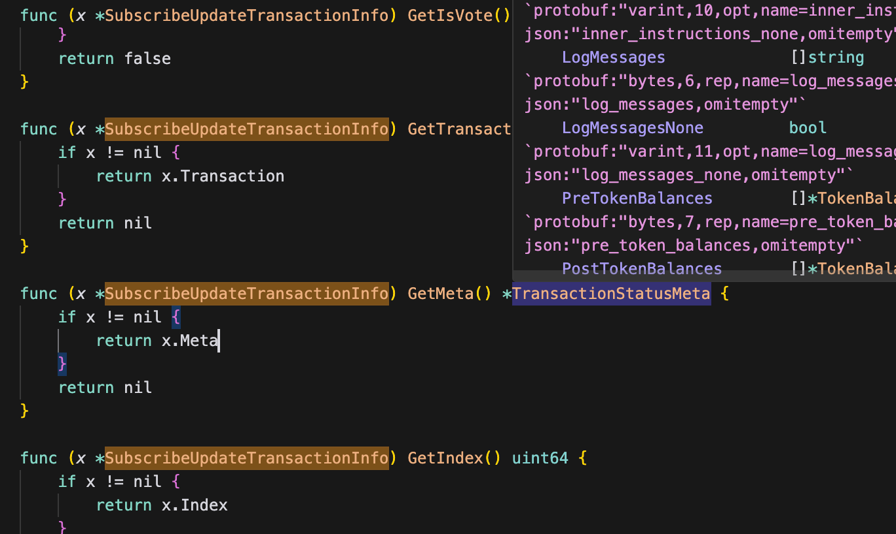

# 交易解析


## 基于 yellow-stone 的结构体解析 pump.fun 的内盘交易数据, 获取目标账号的购买了什么代币

在代码中的接受来 grpc 订阅数据的地方在下方代码段：
```
	for {
		i += 1
		// 重新订阅示例
		if i == *resub {
			subscription = pb.SubscribeRequest{}
			subscription.Slots = make(map[string]*pb.SubscribeRequestFilterSlots)
			subscription.Slots["slots"] = &pb.SubscribeRequestFilterSlots{}
			stream.Send(&subscription)
		}

		// 接收更新
		resp, err := stream.Recv()
		timestamp := time.Now().UnixNano()

		if err == io.EOF {
			return
		}
		if err != nil {
			log.Fatalf("接收更新时发生错误: %v", err)
		}

		log.Printf("%v %v", timestamp, resp)
	}
```
核心的代码是
```
		resp, err := stream.Recv()
		timestamp := time.Now().UnixNano()
```
返回的结构体是：



结构体来自于 proto 文件，golang 可以通过 `protoc` 命令生成对应的结构体。这里我们不进行具体的生成演示，而是直接使用 example 中原本就存在的，感兴趣可以自己生成一次。

目前已知我们的得到的对象是 `var resp *pb.SubscribeUpdate`，那么我们就可以根据这个对象的结构体进行解析。我们可以在 `geyser.pb.go` 中找到对应的结构体，以及这个结构体的方法。



这里可以逐步来进行解析，在上一篇教程中我们已经使用 `-transaction` 来订阅了单个账号的交易，那么我们可以根据输出的数据来逐步解析出我们想要的内容。接下来我们订阅 6969 的账号的交易，执行命令：
```
go run ./cmd/grpc-client/main.go ./cmd/grpc-client/array-flag.go -endpoint https://grpc.chainbuff.com -transactions -transactions-account-include 696969Y6orZEjp4gZtwcCZS7TNVuhMVE6G5mFvdJ4mYq
```

数据如下
```
root@kvm12191 ~/buff/yellowstone-grpc-golang/0x1_paser_transcation/golang # go run ./cmd/grpc-client/main.go ./cmd/grpc-client/array-flag.go -endpoint https://grpc.chainbuff.com -transactions -transactions-account-include 696969Y6orZEjp4gZtwcCZS7TNVuhMVE6G5mFvdJ4mYq 


启动 gRPC 客户端，连接到 grpc.chainbuff.com:443
订阅请求: {"transactions":{"transactions_sub":{"vote":false,"failed":false,"account_include":["696969Y6orZEjp4gZtwcCZS7TNVuhMVE6G5mFvdJ4mYq"]}}}

1735721196245833179 ping:{}
1735721206246505861 ping:{}
1735721216246312521 ping:{}
1735721219225614565 filters:"transactions_sub"  transaction:{transaction:{signature:"^\x96Kh\xee\xb5;e\xd9,\xe88\x9c\"\xea\xa1\x18a2є\x8e\xfd\x82\x86\xca\x13\x01e\x1b\xd6\xdd\xe2\xf0\x07Q\xbc\x01\x9a\xf7%\xfb\xfa\xdaq,*\x13\x1c\xdb\x17\xb6\xf3\x86M\xf8\xde(=3\x0f\x92#\t"  transaction:{signatures:"^\x96Kh\xee\xb5;e\xd9,\xe88\x9c\"\xea\xa1\x18a2є\x8e\xfd\x82\x86\xca\x13\x01e\x1b\xd6\xdd\xe2\xf0\x07Q\xbc\x01\x9a\xf7%\xfb\xfa\xdaq,*\x13\x1c\xdb\x17\xb6\xf3\x86M\xf8\xde(=3\x0f\x92#\t"  message:{header:{num_required_signatures:1  num_readonly_unsigned_accounts:10}  account_keys:"L\\\xe4n\x87\xe3t\x15'\xb9\xa1\x0e2\xb4\xf9\xe5\x96g\xdf\xc7\xd23UJ\xc0\x01\x8f\xee\xeawƮ"  account_keys:"\xb1ߝ,\xcdzpV\xf8\xc6q\x82\x88\xb7|/i\xeb(\x1c\xe8\xceY\x05\xe04'\xab\x95\xc6Wu"  account_keys:"\xad\x11\xe6\xa4\xfc)D\xa4\xfa\x82Q\xbe\xf8\x15Bn\x1b\xfb(ƶdfw`|j\xd9\xf5f\xa6F"  account_keys:"̃\x87\x03\n\xfc\xfbX(\xf33\xad\x02\x07\x95O\xf6\xa1\x0f\xa8j\xaf\x12\x8f\x1bs\t\x1a\x13\xa6\x18*"  account_keys:"\xf2\x02\x18>L6\xfe\xe7\x078e\xf8\xb7\x02\xa9a\x19\xe4\xd2\xe8e}\x14\x8a\\\xb9JZ\xe6l\x8fp"  account_keys:"\xf58o\x12\xbd\x97U\x9f\x86\xe4n\xba\x13x{(\xf8\xd3\xc2Bh\xe6\xb9\xf1\x03f~\x1f\xa0U(\x9b"  account_keys:"\x8c\x97%\x8fN$\x89\xf1\xbb=\x10)\x14\x8e\r\x83\x0bZ\x13\x99\xda\xff\x10\x84\x04\x8e{\xd8\xdb\xe9\xf8Y"  account_keys:"\x01\x82\x84\xc2Z\x05ت\x1f2|\x00\x89F\xfa\x04;Ep\xabVo\xa0\x11\x02\x01\xa0'\xe8\xff\xaf\xaf"  account_keys:"\x00\x00\x00\x00\x00\x00\x00\x00\x00\x00\x00\x00\x00\x00\x00\x00\x00\x00\x00\x00\x00\x00\x00\x00\x00\x00\x00\x00\x00\x00\x00\x00"  account_keys:"\x06\xdd\xf6\xe1\xd7e\xa1\x93\xd9\xcb\xe1F\xce\xeby\xac\x1c\xb4\x85\xed_[7\x91:\x8c\xf5\x85~\xff\x00\xa9"  account_keys:"\x06\xa7\xd5\x17\x19,\\Q!\x8c\xc9L=J\xf1\x7fX\xda\xee\x08\x9b\xa1\xfdD\xe3\xdbي\x00\x00\x00\x00"  account_keys:"\x01V\xe0\xf6\x93fZ\xcfD\xdb\x15h\xbf\x17[\xaaQ\x89˗\xf5\xd2\xff;e]+\xb6\xfdm\x18\xb0"  account_keys:":\x86^i\xee\x0fT\x80ʼ\xf6cW\xe4\xdc/\x18ՍE\xc1\xeat\x89\xfb7#\xd9y<r\xa6"  account_keys:"\xac\xf16\xeb\x01\xfc\x1cN\x88=#ȵ\x84J\xb5\x9a7\xf6j\xddW\xc5\xe9\xac;S\xe0Y\xd3\\d"  account_keys:"\xf3\xa1\x04\x0f\xd8%\xbf\x85\x8c\x1d\xd2\\\x86\xf3\xf6e\x9b\xc3=\n\xba>x\x9ab\xa5,\xaeə\xf7\x81"  account_keys:"\x03\x06Fo\xe5!\x172\xff쭺rÛ缌\xe5\xbb\xc5\xf7\x12k,C\x9b:@\x00\x00\x00"  recent_blockhash:":P?ĝ\x04\xd0\x0b\x04\xad\xbb\xe8)\xc1\x9a\xda\xe8\x1d\xf6\x15r\xe6\x8f\xf5U\xc9f\x08\x85C\"\xbb"  instructions:{program_id_index:6  accounts:"\x00\x01\x00\x07\x08\t\n"}  instructions:{program_id_index:11  accounts:"\x0c\x02\x07\x03\x04\x01\x00\x08\t\n\r\x0b"  data:"f\x06=\x12\x01\xda\xeb\xea|\xce\xe8\xfc6\x0e\x00\x00`\x7f\xf2i\x00\x00\x00\x00"}  instructions:{program_id_index:8  accounts:"\x00\x05"  data:"\x02\x00\x00\x00\xa0%&\x00\x00\x00\x00\x00"}  instructions:{program_id_index:14  data:"Powered by bloXroute Trader Api"}  instructions:{program_id_index:15  data:"\x03\x00\x9f$\x00\x00\x00\x00\x00"}  instructions:{program_id_index:15  data:"\x02@\x19\x01\x00"}  versioned:true}}  meta:{fee:177800  pre_balances:73456155621  pre_balances:0  pre_balances:288801143852731  pre_balances:10338181752  pre_balances:2039280  pre_balances:195879000107  pre_balances:731913600  pre_balances:1461600  pre_balances:1  pre_balances:934087680  pre_balances:1009200  pre_balances:1141440  pre_balances:246641999  pre_balances:112000014  pre_balances:1141440  pre_balances:1  post_balances:72637602327  post_balances:2039280  post_balances:288801151910515  post_balances:11143960182  post_balances:2039280  post_balances:195881500107  post_balances:731913600  post_balances:1461600  post_balances:1  post_balances:934087680  post_balances:1009200  post_balances:1141440  post_balances:246641999  post_balances:112000014  post_balances:1141440  post_balances:1  inner_instructions:{instructions:{program_id_index:9  accounts:"\x07"  data:"\x15\x07\x00"  stack_height:2}  instructions:{program_id_index:8  accounts:"\x00\x01"  data:"\x00\x00\x00\x00\xf0\x1d\x1f\x00\x00\x00\x00\x00\xa5\x00\x00\x00\x00\x00\x00\x00\x06\xdd\xf6\xe1\xd7e\xa1\x93\xd9\xcb\xe1F\xce\xeby\xac\x1c\xb4\x85\xed_[7\x91:\x8c\xf5\x85~\xff\x00\xa9"  stack_height:2}  instructions:{program_id_index:9  accounts:"\x01"  data:"\x16"  stack_height:2}  instructions:{program_id_index:9  accounts:"\x01\x07"  data:"\x12L\\\xe4n\x87\xe3t\x15'\xb9\xa1\x0e2\xb4\xf9\xe5\x96g\xdf\xc7\xd23UJ\xc0\x01\x8f\xee\xeawƮ"  stack_height:2}}  inner_instructions:{index:1  instructions:{program_id_index:9  accounts:"\x04\x01\x03"  data:"\x03|\xce\xe8\xfc6\x0e\x00\x00"  stack_height:2}  instructions:{program_id_index:8  accounts:"\x00\x03"  data:"\x02\x00\x00\x00\xfe3\x070\x00\x00\x00\x00"  stack_height:2}  instructions:{program_id_index:8  accounts:"\x00\x02"  data:"\x02\x00\x00\x00\xb8\xf3z\x00\x00\x00\x00\x00"  stack_height:2}  instructions:{program_id_index:11  accounts:"\r"  data:"\xe4E\xa5.Q˚\x1d\xbd\xdb\x7f\xd3N\xe6a\xee\x01\x82\x84\xc2Z\x05ت\x1f2|\x00\x89F\xfa\x04;Ep\xabVo\xa0\x11\x02\x01\xa0'\xe8\xff\xaf\xaf\xfe3\x070\x00\x00\x00\x00|\xce\xe8\xfc6\x0e\x00\x00\x01L\\\xe4n\x87\xe3t\x15'\xb9\xa1\x0e2\xb4\xf9\xe5\x96g\xdf\xc7\xd23UJ\xc0\x01\x8f\xee\xeawƮ\x02\x01ug\x00\x00\x00\x00F6L\x94\t\x00\x00\x00\xcd\xfbHL\x96\xc7\x02\x00F\x8a(\x98\x02\x00\x00\x00\xcdc6\x00\x05\xc9\x01\x00"  stack_height:2}}  log_messages:"Program ATokenGPvbdGVxr1b2hvZbsiqW5xWH25efTNsLJA8knL invoke [1]"  log_messages:"Program log: Create"  log_messages:"Program TokenkegQfeZyiNwAJbNbGKPFXCWuBvf9Ss623VQ5DA invoke [2]"  log_messages:"Program log: Instruction: GetAccountDataSize"  log_messages:"Program TokenkegQfeZyiNwAJbNbGKPFXCWuBvf9Ss623VQ5DA consumed 1569 of 58986 compute units"  log_messages:"Program return: TokenkegQfeZyiNwAJbNbGKPFXCWuBvf9Ss623VQ5DA pQAAAAAAAAA="  log_messages:"Program TokenkegQfeZyiNwAJbNbGKPFXCWuBvf9Ss623VQ5DA success"  log_messages:"Program 11111111111111111111111111111111 invoke [2]"  log_messages:"Program 11111111111111111111111111111111 success"  log_messages:"Program log: Initialize the associated token account"  log_messages:"Program TokenkegQfeZyiNwAJbNbGKPFXCWuBvf9Ss623VQ5DA invoke [2]"  log_messages:"Program log: Instruction: InitializeImmutableOwner"  log_messages:"Program log: Please upgrade to SPL Token 2022 for immutable owner support"  log_messages:"Program TokenkegQfeZyiNwAJbNbGKPFXCWuBvf9Ss623VQ5DA consumed 1405 of 52399 compute units"  log_messages:"Program TokenkegQfeZyiNwAJbNbGKPFXCWuBvf9Ss623VQ5DA success"  log_messages:"Program TokenkegQfeZyiNwAJbNbGKPFXCWuBvf9Ss623VQ5DA invoke [2]"  log_messages:"Program log: Instruction: InitializeAccount3"  log_messages:"Program TokenkegQfeZyiNwAJbNbGKPFXCWuBvf9Ss623VQ5DA consumed 4188 of 48517 compute units"  log_messages:"Program TokenkegQfeZyiNwAJbNbGKPFXCWuBvf9Ss623VQ5DA success"  log_messages:"Program ATokenGPvbdGVxr1b2hvZbsiqW5xWH25efTNsLJA8knL consumed 27988 of 72000 compute units"  log_messages:"Program ATokenGPvbdGVxr1b2hvZbsiqW5xWH25efTNsLJA8knL success"  log_messages:"Program 6EF8rrecthR5Dkzon8Nwu78hRvfCKubJ14M5uBEwF6P invoke [1]"  log_messages:"Program log: Instruction: Buy"  log_messages:"Program TokenkegQfeZyiNwAJbNbGKPFXCWuBvf9Ss623VQ5DA invoke [2]"  log_messages:"Program log: Instruction: Transfer"  log_messages:"Program TokenkegQfeZyiNwAJbNbGKPFXCWuBvf9Ss623VQ5DA consumed 4645 of 20875 compute units"  log_messages:"Program TokenkegQfeZyiNwAJbNbGKPFXCWuBvf9Ss623VQ5DA success"  log_messages:"Program 11111111111111111111111111111111 invoke [2]"  log_messages:"Program 11111111111111111111111111111111 success"  log_messages:"Program 11111111111111111111111111111111 invoke [2]"  log_messages:"Program 11111111111111111111111111111111 success"  log_messages:"Program 6EF8rrecthR5Dkzon8Nwu78hRvfCKubJ14M5uBEwF6P invoke [2]"  log_messages:"Program 6EF8rrecthR5Dkzon8Nwu78hRvfCKubJ14M5uBEwF6P consumed 2003 of 8787 compute units"  log_messages:"Program 6EF8rrecthR5Dkzon8Nwu78hRvfCKubJ14M5uBEwF6P success"  log_messages:"Program data: vdt/007mYe4BgoTCWgXYqh8yfACJRvoEO0Vwq1ZvoBECAaAn6P+vr/4zBzAAAAAAfM7o/DYOAAABTFzkbofjdBUnuaEOMrT55ZZn38fSM1VKwAGP7up3xq4CAXVnAAAAAEY2TJQJAAAAzftITJbHAgBGiiiYAgAAAM1jNgAFyQEA"  log_messages:"Program 6EF8rrecthR5Dkzon8Nwu78hRvfCKubJ14M5uBEwF6P consumed 38953 of 44012 compute units"  log_messages:"Program 6EF8rrecthR5Dkzon8Nwu78hRvfCKubJ14M5uBEwF6P success"  log_messages:"Program 11111111111111111111111111111111 invoke [1]"  log_messages:"Program 11111111111111111111111111111111 success"  log_messages:"Program HQ2UUt18uJqKaQFJhgV9zaTdQxUZjNrsKFgoEDquBkcx invoke [1]"  log_messages:"Program log: Powered by bloXroute Trader Api"  log_messages:"Program HQ2UUt18uJqKaQFJhgV9zaTdQxUZjNrsKFgoEDquBkcx consumed 803 of 4909 compute units"  log_messages:"Program HQ2UUt18uJqKaQFJhgV9zaTdQxUZjNrsKFgoEDquBkcx success"  log_messages:"Program ComputeBudget111111111111111111111111111111 invoke [1]"  log_messages:"Program ComputeBudget111111111111111111111111111111 success"  log_messages:"Program ComputeBudget111111111111111111111111111111 invoke [1]"  log_messages:"Program ComputeBudget111111111111111111111111111111 success"  pre_token_balances:{account_index:4  mint:"6tqfQ9SvLGbd9phMd5PjzHJC9UNYVup47hzf5ZXpump"  ui_token_amount:{ui_amount:7.25027626433097e+08  decimals:6  amount:"725027626433097"  ui_amount_string:"725027626.433097"}  owner:"EmLVeFvjPbReG9fuFhfdjkthuDU8MvaNgVmpYuiWSmzy"  program_id:"TokenkegQfeZyiNwAJbNbGKPFXCWuBvf9Ss623VQ5DA"}  post_token_balances:{account_index:1  mint:"6tqfQ9SvLGbd9phMd5PjzHJC9UNYVup47hzf5ZXpump"  ui_token_amount:{ui_amount:1.5629334138492e+07  decimals:6  amount:"15629334138492"  ui_amount_string:"15629334.138492"}  owner:"696969Y6orZEjp4gZtwcCZS7TNVuhMVE6G5mFvdJ4mYq"  program_id:"TokenkegQfeZyiNwAJbNbGKPFXCWuBvf9Ss623VQ5DA"}  post_token_balances:{account_index:4  mint:"6tqfQ9SvLGbd9phMd5PjzHJC9UNYVup47hzf5ZXpump"  ui_token_amount:{ui_amount:7.09398292294605e+08  decimals:6  amount:"709398292294605"  ui_amount_string:"709398292.294605"}  owner:"EmLVeFvjPbReG9fuFhfdjkthuDU8MvaNgVmpYuiWSmzy"  program_id:"TokenkegQfeZyiNwAJbNbGKPFXCWuBvf9Ss623VQ5DA"}  return_data_none:true  compute_units_consumed:68194}  index:1521}  slot:311158572}

```

通过结构体对和数据的对比，然后通过结构体中返回的函数推导出我们想要的数据。比如我想解析出来跟单目标交易是买入还是卖出：



在上方的输出中我们可以看到 `log_messages` 中包含了我们想要的数据，那么我们就需要定位到 `log_messages` 在什么结构体中，我们如何取出来。



那么我们就可以通过来解析获得我们想要的数据
```
		if resp.GetTransaction() != nil {
			for _, logMessage := range resp.GetTransaction().GetTransaction().Meta.GetLogMessages() {
				log.Printf("%v %v", timestamp, logMessage)
			}
		}
```

输出如下：
```
1735724010355353009 Program 11111111111111111111111111111111 invoke [1]
1735724010355353009 Program 11111111111111111111111111111111 invoke [1]
1735724010355353009 Program 11111111111111111111111111111111 success
1735724010355353009 Program 6EF8rrecthR5Dkzon8Nwu78hRvfCKubJ14M5uBEwF6P invoke [1]
1735724010355353009 Program log: Instruction: Sell
1735724010355353009 Program TokenkegQfeZyiNwAJbNbGKPFXCWuBvf9Ss623VQ5DA invoke [2]
1735724010355353009 Program log: Instruction: Transfer
1735724010355353009 Program TokenkegQfeZyiNwAJbNbGKPFXCWuBvf9Ss623VQ5DA consumed 4645 of 581291 compute units
1735724010355353009 Program TokenkegQfeZyiNwAJbNbGKPFXCWuBvf9Ss623VQ5DA success
1735724010355353009 Program 6EF8rrecthR5Dkzon8Nwu78hRvfCKubJ14M5uBEwF6P invoke [2]
1735724010355353009 Program 6EF8rrecthR5Dkzon8Nwu78hRvfCKubJ14M5uBEwF6P consumed 2003 of 573161 compute units
1735724010355353009 Program 6EF8rrecthR5Dkzon8Nwu78hRvfCKubJ14M5uBEwF6P success
1735724010355353009 Program data: vdt/007mYe6zHcAlY14i2tRDMvDhCXwSBkWMDvMwMEpvPdIxdq467zcO8SsAAAAAtzvqsTcXAAAAx0Yea+RR6ndw77ayt+Rqi35T1RkqAVEfobcLtcM1Cq3pC3VnAAAAADhQegMHAAAADDABMebLAwA4pFYHAAAAAAyY7uRUzQIA
1735724010355353009 Program 6EF8rrecthR5Dkzon8Nwu78hRvfCKubJ14M5uBEwF6P consumed 30418 of 599850 compute units
1735724010355353009 Program 6EF8rrecthR5Dkzon8Nwu78hRvfCKubJ14M5uBEwF6P success
1735724010355353009 Program TokenkegQfeZyiNwAJbNbGKPFXCWuBvf9Ss623VQ5DA invoke [1]
1735724010355353009 Program log: Instruction: CloseAccount
1735724010355353009 Program TokenkegQfeZyiNwAJbNbGKPFXCWuBvf9Ss623VQ5DA consumed 2916 of 569432 compute units
1735724010355353009 Program TokenkegQfeZyiNwAJbNbGKPFXCWuBvf9Ss623VQ5DA success

```

其中有 `Program log: Instruction: Sell` 和 `Program log: Instruction: Buy` 那么我们就可以通过字符串匹配出我们想要的数据。