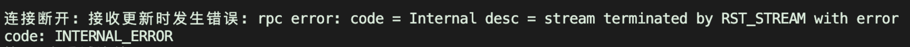

# 0x3_keepalive

## keepalive
在使用 gRPC 时，keepalive 是用来检测连接是否正常的一种机制。而社区节点是通过 cf 进行的dns解析和负载均衡。使用 yellow-stone 的 example 代码时，keepalive 的实现是基于 google 的官方库 "google.golang.org/grpc/keepalive" 。在连接社区节点的时候会产生一个错误 



## 解决方案
这是一个不成熟的方案，但是可以解决这个问题。不是那么优雅,在我们发送订阅请求后，启动一个 goroutine 来发送 ping 请求。接下来就正常处理订阅的业务逻辑即可
```
	stream, err := client.Subscribe(ctx)
	if err != nil {
		log.Fatalf("%v", err)
	}
	err = stream.Send(&subscription)
	if err != nil {
		log.Fatalf("%v", err)
	}

	// 在发送订阅请求后，启动 ping 发送器
	go func() {
		ticker := time.NewTicker(pingInterval)
		defer ticker.Stop()

		for range ticker.C {
			lastPingTime = time.Now()
			err := stream.Send(&pb.SubscribeRequest{
				Ping: &pb.SubscribeRequestPing{},
			})
			if err != nil {
				log.Printf("发送 ping 失败: %v", err)
				return
			}
			//log.Printf("发送 ping - 时间: %v", lastPingTime.Format("15:04:05.000"))
		}
	}()
```

需要注意点：
1、需要替换官方的 keepalive 实现
2、这个解决方案暂时只适用于临时解决当前社区节点的连接问题